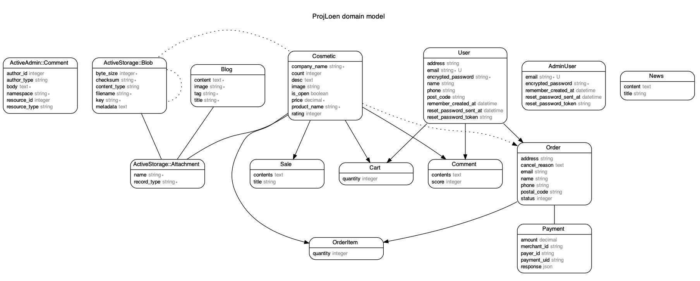

# アプリケーションの概要

## **韓国コスメ専門ECサイト**

>コスパの良い韓国コスメが若い女性に流行っていることと韓国人である点を生かして、各種オンラインストアと連携して韓国製品を持ってきて販売しているという風に想定しで製作しました。
 

# アプリケーションの機能一覧

- **サイト管理者機能（商品登録，照会、統計一覧、記事投稿など全体のサイト管理）**
  - 管理者ID：admin@example.com
  - PASSWORD : password
- **ログイン & ログアウト**
- **マイページ機能**
  - 注文状況の確認
  - 会員情報の変更
  - 注文経歴
- **商品購入**
  - カート機能
  - 決済機能
- **商品絞り込み機能**
  - 星評価（1~5）順
  - 価格順
  - メーカー
  - 売れ筋順
- **商品一覧**
  - コメント作成機能
    - 作成 
    - 修正
    - 削除
    - 照会
  - 星評価機能
- **記事一覧機能**

# アプリケーション内で使用している技術一覧

- フレームワーク : Ruby on Rails
- 使用している言語等 : Ruby, JavaScript(Jquery), Ajax, Bootstrap, CSS, HTML..
- デプロイ : Heroku
- データベース : postgresql
- 開発ツール : GitHub, SourceTree
- 画像アップロードライブラリ : Active record  + AWS S3

# データベースER図

